# UML Component Diagram: Competitive Exam Intelligence System

This document contains the UML component diagram showing the system architecture layers and component interactions.

## Component Diagram

```mermaid
graph TB
    %% External Systems
    subgraph "External Systems"
        YT[YouTube RSS API]
        PIB[PIB Website]
        GOV[Government Portals]
        GEMINI[Google Gemini API]
        DB[(PostgreSQL Database)]
    end

    %% Presentation Layer
    subgraph "Presentation Layer"
        CLI[CLI Interface]
        LOGS[Logging System]
        MONITOR[Performance Monitor]
    end

    %% Service Layer
    subgraph "Service Layer"
        SS[Scraping Service]
        CS[Categorization Service]
        SumS[Summarization Service]
        RS[Ranking Service]
        DS[Digest Generation Service]
        PIPELINE[Pipeline Orchestrator]
    end

    %% Business Logic Layer
    subgraph "Business Logic Layer"
        subgraph "Scrapers"
            YS[YouTube Scraper]
            PS[PIB Scraper]
            GS[Gov Schemes Scraper]
            SF[Scraper Factory]
        end
        
        subgraph "AI Agents"
            CA[Categorization Agent]
            SA[Summarization Agent]
            RA[Ranking Agent]
            DA[Digest Agent]
        end
        
        subgraph "Ranking Strategies"
            URS[UPSC Strategy]
            SRS[SSC Strategy]
            BRS[Banking Strategy]
        end
    end

    %% Data Access Layer
    subgraph "Data Access Layer"
        subgraph "Repositories"
            AR[Article Repository]
            SR[Summary Repository]
            RR[Ranking Repository]
            CR[Category Repository]
            SoR[Source Repository]
        end
        
        subgraph "ORM Layer"
            MODELS[SQLAlchemy Models]
            CONN[Database Connection]
        end
    end

    %% Infrastructure Layer
    subgraph "Infrastructure Layer"
        CONFIG[Configuration Manager]
        EXCEPT[Exception Handling]
        RETRY[Retry Logic]
        CACHE[Caching Layer]
    end

    %% Component Interactions
    
    %% Presentation to Service
    CLI --> PIPELINE
    PIPELINE --> SS
    PIPELINE --> CS
    PIPELINE --> SumS
    PIPELINE --> RS
    PIPELINE --> DS
    
    %% Service to Business Logic
    SS --> SF
    SF --> YS
    SF --> PS
    SF --> GS
    
    CS --> CA
    SumS --> SA
    RS --> RA
    DS --> DA
    
    RA --> URS
    RA --> SRS
    RA --> BRS
    
    %% Business Logic to External
    YS --> YT
    PS --> PIB
    GS --> GOV
    
    CA --> GEMINI
    SA --> GEMINI
    RA --> GEMINI
    DA --> GEMINI
    
    %% Service to Data Access
    SS --> AR
    SS --> SoR
    CS --> AR
    CS --> CR
    SumS --> AR
    SumS --> SR
    RS --> AR
    RS --> RR
    DS --> RR
    
    %% Data Access to Database
    AR --> MODELS
    SR --> MODELS
    RR --> MODELS
    CR --> MODELS
    SoR --> MODELS
    
    MODELS --> CONN
    CONN --> DB
    
    %% Infrastructure Dependencies
    PIPELINE --> CONFIG
    SS --> EXCEPT
    CS --> EXCEPT
    SumS --> EXCEPT
    RS --> EXCEPT
    DS --> EXCEPT
    
    YS --> RETRY
    PS --> RETRY
    GS --> RETRY
    CA --> RETRY
    SA --> RETRY
    RA --> RETRY
    DA --> RETRY
    
    %% Monitoring
    PIPELINE --> MONITOR
    SS --> LOGS
    CS --> LOGS
    SumS --> LOGS
    RS --> LOGS
    DS --> LOGS
    
    MONITOR --> LOGS

    %% Styling
    classDef external fill:#ffcccc
    classDef presentation fill:#ccffcc
    classDef service fill:#ccccff
    classDef business fill:#ffffcc
    classDef data fill:#ffccff
    classDef infrastructure fill:#ccffff
    
    class YT,PIB,GOV,GEMINI,DB external
    class CLI,LOGS,MONITOR presentation
    class SS,CS,SumS,RS,DS,PIPELINE service
    class YS,PS,GS,SF,CA,SA,RA,DA,URS,SRS,BRS business
    class AR,SR,RR,CR,SoR,MODELS,CONN data
    class CONFIG,EXCEPT,RETRY,CACHE infrastructure
```



## Architecture Layers

### 1. Presentation Layer
**Purpose**: User interface and system monitoring
- **CLI Interface**: Command-line interface for pipeline execution
- **Logging System**: Structured logging with timestamps and context
- **Performance Monitor**: Tracks execution times and system metrics

**Key Characteristics**:
- Minimal business logic
- Focuses on user interaction and system observability
- Delegates all processing to service layer

### 2. Service Layer
**Purpose**: Business workflow orchestration
- **Pipeline Orchestrator**: Coordinates the complete processing workflow
- **Scraping Service**: Manages content acquisition from multiple sources
- **Categorization Service**: Orchestrates content classification
- **Summarization Service**: Manages AI-powered content summarization
- **Ranking Service**: Coordinates relevance scoring with strategy selection
- **Digest Generation Service**: Compiles final formatted output

**Key Characteristics**:
- Implements business workflows
- Coordinates between business logic and data access layers
- Handles transaction boundaries
- Provides clean interfaces for presentation layer

### 3. Business Logic Layer
**Purpose**: Core domain logic and algorithms

#### Scrapers Subsystem
- **Scraper Factory**: Creates appropriate scraper instances
- **YouTube Scraper**: Extracts video transcripts from exam channels
- **PIB Scraper**: Fetches government press releases
- **Government Schemes Scraper**: Collects welfare program information

#### AI Agents Subsystem
- **Categorization Agent**: Classifies content into exam categories
- **Summarization Agent**: Generates exam-focused summaries
- **Ranking Agent**: Scores content relevance using strategies
- **Digest Agent**: Compiles formatted output

#### Ranking Strategies Subsystem
- **UPSC Strategy**: Civil services exam-specific scoring
- **SSC Strategy**: Staff selection exam-specific scoring
- **Banking Strategy**: Banking exam-specific scoring

**Key Characteristics**:
- Contains core domain logic
- Implements design patterns (Factory, Strategy, Template Method)
- Independent of external systems and data storage
- Highly testable and maintainable

### 4. Data Access Layer
**Purpose**: Data persistence and retrieval

#### Repositories Subsystem
- **Article Repository**: Manages article data with exam-specific queries
- **Summary Repository**: Handles AI-generated summaries
- **Ranking Repository**: Manages relevance scores and rankings
- **Category Repository**: Handles exam category data
- **Source Repository**: Manages content source information

#### ORM Layer
- **SQLAlchemy Models**: Object-relational mapping for database entities
- **Database Connection**: Connection pooling and session management

**Key Characteristics**:
- Abstracts database details from business logic
- Implements Repository pattern for clean data access
- Handles database sessions and transactions
- Provides type-safe data operations

### 5. Infrastructure Layer
**Purpose**: Cross-cutting concerns and system utilities
- **Configuration Manager**: Centralized configuration management
- **Exception Handling**: Comprehensive error handling and classification
- **Retry Logic**: Exponential backoff for transient failures
- **Caching Layer**: Performance optimization for frequently accessed data

**Key Characteristics**:
- Supports all other layers
- Handles non-functional requirements
- Provides system-wide utilities
- Ensures reliability and performance

## Component Interactions

### Data Flow Patterns

#### 1. Content Acquisition Flow
```
CLI → Pipeline → Scraping Service → Scraper Factory → Concrete Scrapers → External APIs
```

#### 2. AI Processing Flow
```
Service Layer → AI Agents → Gemini API → Processed Results → Repositories → Database
```

#### 3. Strategy Selection Flow
```
Ranking Service → Ranking Agent → Strategy Selection → Concrete Strategy → Scoring Result
```

### Communication Patterns

#### 1. Synchronous Communication
- **Service to Business Logic**: Direct method calls
- **Business Logic to External APIs**: HTTP requests with retry logic
- **Data Access to Database**: SQL queries via ORM

#### 2. Dependency Injection
- **Services receive repositories**: Constructor injection
- **Agents receive configuration**: Constructor injection
- **Strategies receive weights**: Constructor injection

#### 3. Error Propagation
- **Transient Errors**: Bubble up with retry logic
- **Permanent Errors**: Fail fast with clear messages
- **Unknown Errors**: Classified and handled appropriately

## Design Principles Applied

### Separation of Concerns
- Each layer has distinct responsibilities
- Clear boundaries between layers
- Minimal coupling between components

### Dependency Inversion
- High-level modules depend on abstractions
- Services depend on repository interfaces
- Agents depend on strategy interfaces

### Single Responsibility
- Each component has one reason to change
- Clear component boundaries
- Focused interfaces

### Open/Closed Principle
- New scrapers can be added without modifying existing code
- New ranking strategies can be plugged in
- New services can be added to the pipeline

## Scalability Considerations

### Horizontal Scaling
- **Stateless Services**: All services are stateless and can be replicated
- **Database Connection Pooling**: Efficient resource utilization
- **External API Rate Limiting**: Prevents service degradation

### Performance Optimization
- **Caching Layer**: Reduces database load for frequently accessed data
- **Bulk Operations**: Efficient batch processing in repositories
- **Async Processing**: Non-blocking operations where possible

### Monitoring and Observability
- **Performance Tracking**: Execution time monitoring
- **Error Tracking**: Comprehensive error logging
- **Health Checks**: System health monitoring

## Technology Stack Integration

### Core Technologies
- **Python 3.9+**: Primary programming language
- **SQLAlchemy**: ORM for database operations
- **PostgreSQL**: Primary data store
- **Google Gemini API**: AI processing
- **Pydantic**: Data validation and serialization

### Supporting Technologies
- **Docker**: Containerization
- **Render**: Cloud deployment
- **Logging**: Structured logging with JSON format
- **Environment Variables**: Configuration management

This component diagram demonstrates a well-architected system with clear separation of concerns, proper abstraction layers, and scalable design patterns suitable for both academic study and production deployment.